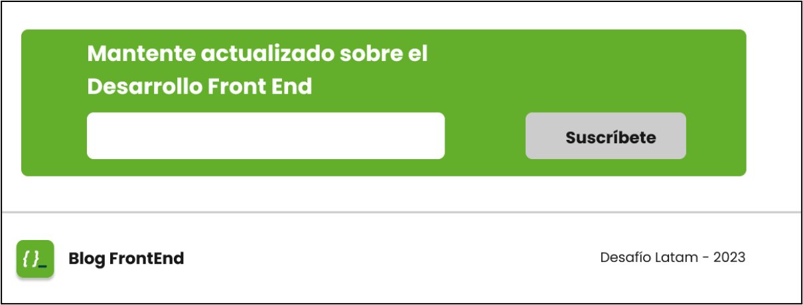
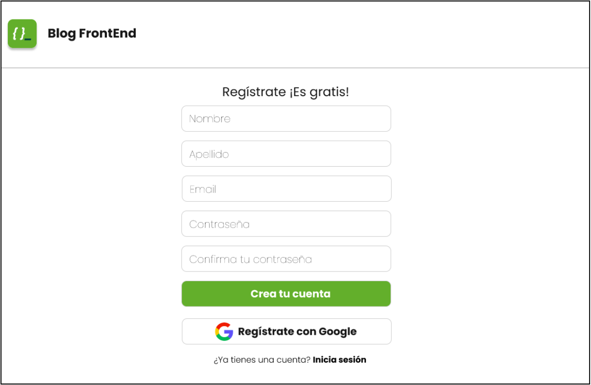
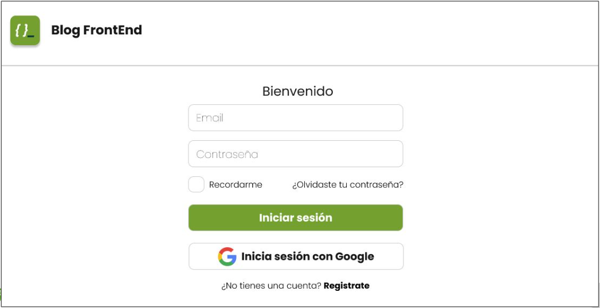
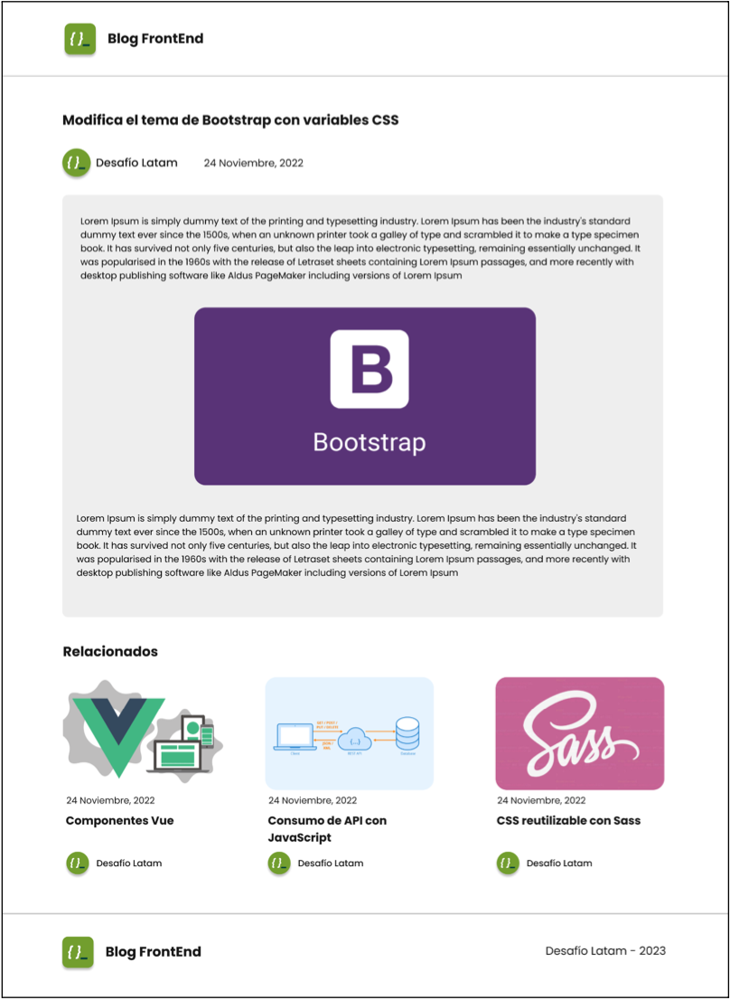

# Blog FrontEnd con Sass

Este repositorio contiene un proyecto desarrollado como parte del bootcamp de desarrollo de aplicaciones web front-end. El objetivo de este desafío es implementar la metodología BEM (Block, Element, Modifier) para la estructuración del CSS, junto con el uso de Sass siguiendo el patrón de arquitectura 7-1.

Haz [click aquí](https://germanriveros.cl/BlogFrontEnd-Sass/) para ver el sitio.

 [Enlace](https://www.figma.com/design/adUnzFLoVoDlhv61kvJNjN/Blog-FrontEnd?node-id=1-2) de la primera maqueta.

 Se agrega a esta página sobre el footer el siguiente formulario de suscripción:

Por otro lado, se incluyen las páginas de:

- Registro:

- Login:

- Detalle post:

